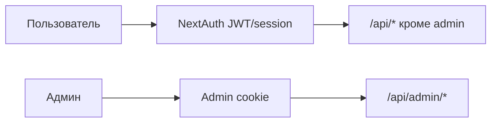
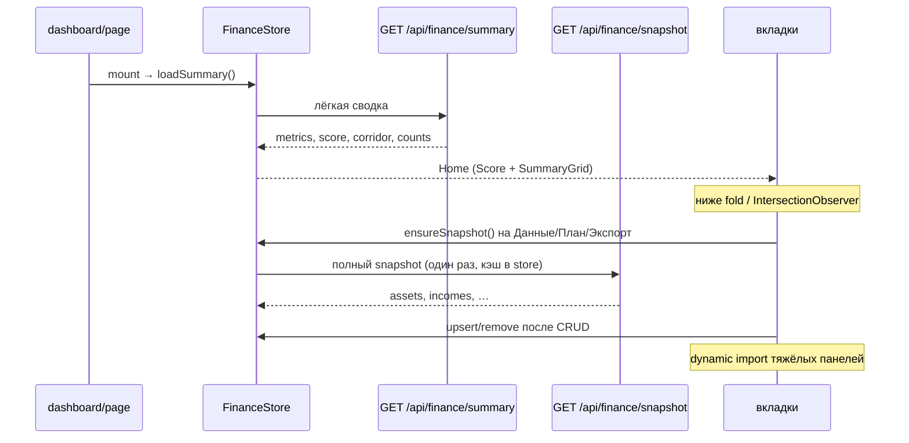

# ФИНКОН — документация для разработчика

Техническая документация: стек, карта кода, потоки данных, полный каталог API, security, запуск.

Связанный документ: [PRODUCT.md](./PRODUCT.md) (продукт для менеджера, без реализации).

> Перед правками Next.js сверяйтесь с `node_modules/next/dist/docs/` — в проекте Next.js 16 с отличиями от «классического» App Router из обучающих материалов.

---

## 1. Стек

| Слой | Технология |
|------|------------|
| Framework | **Next.js 16.2** (App Router), монолит UI + API |
| UI | **React 19**, Tailwind CSS 4, Recharts |
| Auth | **NextAuth v5** (credentials) + отдельная admin cookie-сессия |
| Данные | **Upstash Redis** (REST), фасад `prisma`-like в `shared/db` |
| Валидация | **Zod** |
| PDF | **jsPDF** (+ Noto Sans для кириллицы) |
| CSV | PapaParse |
| Worker | `tsx scripts/simulation-worker.ts` (опционально) |

Язык UI и продуктовых текстов — русский. Валюта по умолчанию — ₽.

---

## 2. Карта `src/`

```
src/
  app/                 — маршруты Next.js (pages + api)
    api/               — тонкий HTTP-слой (auth → service → response)
    dashboard/         — кабинет пользователя
    admin/             — админ UI
    (landing, FAQ, …)
  components/          — UI: finance/, plan/, layout/, pwa/, …
  modules/             — доменная логика (без React, кроме finance-store)
    auth/              — регистрация
    finance/           — snapshot, summary, store, loan/portfolio math
    plan/              — cash-flow engine, projection input, goals
    iplan/             — инвестиционный план
    scenarios/         — IF/ELSE rules, templates, modifiers
    simulation/        — Monte Carlo + jobs
    dashboard/         — scoring, insights
    budget/            — envelopes, savings corridor
    reports/           — PDF build
    admin/             — admin service + audit log
  shared/              — db, auth.config, session, admin-auth, api-fetch, offline
  content/             — help.ts (FAQ, подсказки вкладок)
```

Правило: **route handlers тонкие**; расчёты и доступ к Redis — в `modules/*` и `shared/*`.

---

## 3. Auth

### Пользователь (NextAuth)

- Конфиг: `src/shared/auth.config.ts` / handlers в `/api/auth/[...nextauth]`
- Сессия → `auth()`; для API: `requireUserId()` в `src/shared/session.ts`
- Регистрация: `POST /api/auth/register` → `modules/auth`
- Env: `AUTH_SECRET` (обязателен в production), опционально `NEXTAUTH_SECRET`, `NEXTAUTH_URL`

### Админ (отдельная cookie)

- Логин/пароль из env: `ADMIN_LOGIN`, `ADMIN_PASSWORD` (без хардкода в production)
- Cookie-сессия, проверка `requireAdmin()` в `src/shared/admin-auth.ts`
- Не пересекается с пользовательской NextAuth-сессией



---

## 4. Данные и ownership

- Хранилище: Upstash Redis через фасад в `src/shared/db` (коллекции вроде `user`, `asset`, …).
- Каждая финансовая сущность привязана к **`userId`**. API всегда фильтрует по текущему пользователю; чужие id → 404/403.
- История изменений пишется при CRUD ключевых сущностей и доступна через `/api/history` (user) и admin history.

Ключевые загрузчики:

| Функция / файл | Назначение |
|----------------|------------|
| `loadUserFinanceSummary` | Метрики + скор + counts без массивов сущностей |
| `loadUserFinanceSnapshot` | Полный набор сущностей для вкладок |
| `loadPlanInputForUser` | Вход для projection (делегирует в snapshot loader) |

---

## 5. Клиентский поток данных



- `apiFetch` / `apiFetchJson` (`src/shared/api-fetch.ts`) — единый fetch; при 401 редирект на вход.
- Projection (`/api/plan/projection`) — только для подразделов Обзор / Monte Carlo, не на каждое открытие дашборда.
- IPlan: базовый GET/PUT без MC; Monte Carlo для iplan — `?mc=1`.
- PWA: `public/sw.js` **не кэширует** `/api/*`; офлайн только просмотр shell, запись только online (`shared/offline.ts`).

---

## 6. Domain engines

| Модуль | Точки входа | Роль |
|--------|-------------|------|
| `plan/` | `cashflow.engine`, `plan-data.service`, `goal-funding`, `goal-paths` | Детерминированный помесячный прогноз |
| `iplan/` | `iplan.engine`, `budget`, `stream-math` | Годовой инвест-план, варианты, сверка с профицитом |
| `scenarios/` | `rule-engine`, `rule-validation`, templates | IF/ELSE, модификаторы плана |
| `simulation/` | `monte-carlo.engine`, `simulation.service` | Jobs + MC траектории |
| `dashboard/` | `scoring`, `insights` | Скор 0–100 и тексты инсайтов |
| `budget/` | `envelopes`, `savings-corridor` | Конверты и коридор накоплений |
| `reports/` | `pdf-export`, `build-report-data` | PDF |

---

## 7. Полный каталог API

Легенда auth: **U** = `requireUserId`, **A** = `requireAdmin`, **—** = публичный / NextAuth handler.

### Auth

| Method | Path | Auth | Кратко |
|--------|------|------|--------|
| GET/POST | `/api/auth/[...nextauth]` | — | NextAuth |
| POST | `/api/auth/register` | — | Регистрация |

### Finance aggregate

| Method | Path | Auth | Кратко |
|--------|------|------|--------|
| GET | `/api/finance/summary` | U | Сводка + скор без entity arrays |
| GET | `/api/finance/snapshot` | U | Полный snapshot сущностей |

### CRUD entities

| Method | Path | Auth | Кратко |
|--------|------|------|--------|
| GET, POST | `/api/assets` | U | Список / создать актив |
| PATCH, DELETE | `/api/assets/[id]` | U | Обновить / удалить |
| GET, POST | `/api/liabilities` | U | Пассивы |
| PATCH, DELETE | `/api/liabilities/[id]` | U | |
| GET, POST | `/api/incomes` | U | Доходы |
| PATCH, DELETE | `/api/incomes/[id]` | U | |
| GET, POST | `/api/expenses` | U | Расходы |
| PATCH, DELETE | `/api/expenses/[id]` | U | |
| GET, POST | `/api/goals` | U | Цели |
| PATCH, DELETE | `/api/goals/[id]` | U | |
| GET, POST | `/api/budget-categories` | U | Конверты |
| PATCH, DELETE | `/api/budget-categories/[id]` | U | |
| GET, PATCH | `/api/macro` | U | Макропараметры прогноза |

### Scenarios & plan

| Method | Path | Auth | Кратко |
|--------|------|------|--------|
| GET, POST | `/api/scenarios` | U | Список / создать |
| GET, PATCH | `/api/scenarios/[id]` | U | Чтение / rules + meta |
| POST | `/api/scenarios/[id]/activate` | U | Активный сценарий |
| POST | `/api/scenarios/[id]/validate-rules` | U | Валидация IF/ELSE |
| GET | `/api/plan/projection` | U | Детерминированный прогноз (`?scenarioId=`) |
| GET | `/api/plan/compare` | U | Сравнение сценариев |
| GET, PUT | `/api/iplan` | U | Инвест-план; `?mc=1` для MC |
| GET, POST | `/api/simulations` | U | Список / enqueue MC |
| GET | `/api/simulations/[id]` | U | Статус / результат job |

### Import / export / history

| Method | Path | Auth | Кратко |
|--------|------|------|--------|
| POST | `/api/import/csv` | U | CSV import |
| GET, POST | `/api/export/pdf` | U | PDF (шаблон / с конфигом) |
| GET | `/api/history` | U | История пользователя |

### Admin

| Method | Path | Auth | Кратко |
|--------|------|------|--------|
| POST | `/api/admin/auth/login` | — | Логин админа (env creds) |
| POST | `/api/admin/auth/logout` | A | Выход |
| GET | `/api/admin/users` | A | Список пользователей |
| GET, PATCH, POST | `/api/admin/users/[id]` | A | Карточка / правка / действия |
| GET, PATCH, DELETE | `/api/admin/users/[id]/finance` | A | Финансы пользователя |
| GET | `/api/admin/users/[id]/history` | A | История |
| GET | `/api/admin/jobs` | A | Очередь симуляций |
| GET | `/api/admin/logs` | A | Audit log админа |

---

## 8. Security

- **`AUTH_SECRET`** обязателен в production (подпись сессий).
- **`ADMIN_LOGIN` / `ADMIN_PASSWORD`** — только из env в production; нет дефолтных паролей в коде.
- Ownership: все user finance routes через `userId` сессии.
- Service Worker **не кэширует** `/api/*` — иначе риск отдать чужие/устаревшие данные из Cache API.
- Admin и user sessions разделены — компрометация одной не открывает другую автоматически.
- Пароли пользователей: bcrypt (`bcryptjs`).

Регуляторный дисклеймер — в UI и PDF (не инвестрекомендация).

---

## 9. Запуск

1. Upstash Redis → `UPSTASH_REDIS_REST_URL`, `UPSTASH_REDIS_REST_TOKEN`.
2. Скопировать `.env.example` → `.env` и заполнить:

```env
UPSTASH_REDIS_REST_URL=
UPSTASH_REDIS_REST_TOKEN=
AUTH_SECRET=          # openssl rand -base64 32
NEXTAUTH_URL=http://localhost:3000
ADMIN_LOGIN=
ADMIN_PASSWORD=
```

3. Команды:

```bash
npm install
npm run dev          # http://localhost:3000
npm run worker       # опционально: очередь Monte Carlo
npm run build && npm start
```

В MVP job Monte Carlo также может обрабатываться асинхронно из API после постановки в очередь.

---

## 10. Шпаргалка: где править что

| Задача | Куда смотреть |
|--------|----------------|
| Текст FAQ / подсказки вкладок | `src/content/help.ts` |
| Скор и инсайты Главной | `modules/dashboard/scoring.ts`, `insights.ts` |
| Загрузка данных кабинета | `modules/finance/finance-summary.ts`, `finance-snapshot.ts`, `finance-store.tsx` |
| Вкладки дашборда | `app/dashboard/page.tsx`, `components/finance/*`, `components/plan/*` |
| Cash-flow прогноз | `modules/plan/cashflow.engine.ts` |
| IF/ELSE сценарии | `modules/scenarios/*`, `components/scenarios/ScenarioRulesEditor.tsx` |
| Monte Carlo | `modules/simulation/*`, `api/simulations` |
| Инвест-план | `modules/iplan/*`, `api/iplan` |
| PDF | `modules/reports/*`, `api/export/pdf` |
| Auth пользователя | `shared/auth.config.ts`, `shared/session.ts` |
| Auth админа | `shared/admin-auth.ts`, `api/admin/auth/*` |
| PWA / offline | `public/sw.js`, `shared/offline.ts`, `components/pwa/*` |
| Redis / модели | `shared/db` |

---

## 11. Известные границы / бэклог

- Shared read-only планы для консультанта — не реализованы (роль `CONSULTANT` в модели есть).
- Production-очередь (BullMQ и т.п.) — сейчас Redis jobs + опциональный worker.
- Исторический bootstrap доходностей — не в MVP.
